# Meteorology Discovery & Loading Flow - Mermaid Diagram

## 4-Phase STAC-Based Workflow

```mermaid
graph TD
    subgraph Phase1["Phase 1: Discovery"]
        INPUTS["Inputs:<br/>Required Variables<br/>T2M_MIN, T2M_MAX, VPD, TOTAL_PREC<br/>SSRD, STRD, SKT, SNOWFALL<br/>CO2, BURNED_AREA<br/>Temporal Range: 2020-01 to 2020-12"]
        QUERY["STAC Query<br/>discover_stac_items()<br/>For each variable:<br/>• Query catalog recursively<br/>• Filter by cardamom:variable<br/>• Filter by temporal range<br/>• Collect matching items"]
        OUTPUT1["Discovery Output<br/>Dict of STAC items per variable<br/>{<br/>  't2m_min': [item_2020_01, ...],<br/>  't2m_max': [...],<br/>  ...<br/>}"]
    end

    subgraph Phase2["Phase 2: Loading"]
        TEMPORAL["Handle 3 Temporal Structures<br/>load_variable_from_stac_items()<br/><br/>Structure 1: Single Month File<br/>• 1 time step per file<br/>• Shape: [1, 360, 720]<br/><br/>Structure 2: Yearly Aggregation<br/>• 12 time steps per file<br/>• Shape: [12, 360, 720]<br/><br/>Structure 3: Full Time-Series<br/>• Many time steps in one file<br/>• Shape: [555, 360, 720]"]
        OPERATIONS["Loading Operations<br/>1. Get NetCDF URL from item asset<br/>2. Load: xr.open_dataset(url)<br/>3. Extract time dimension<br/>4. Interpret CF time encoding<br/>5. Concatenate along time<br/><br/>Result: Dict[variable → xr.Dataset]"]
    end

    subgraph Phase3["Phase 3: Validation (CRITICAL)"]
        CHECKS["Validation Checks<br/>validate_meteorology_completeness()<br/><br/>For EACH variable, check:<br/>✓ No missing months in range<br/>✓ All required months present<br/><br/>Outcome:<br/>✓ Success → Proceed<br/>✗ Failure → RAISE EXCEPTION"]
        SCIENCE["Scientific Rationale<br/>Meteorology MUST be complete:<br/>• Carbon cycle models need<br/>  continuous forcing data<br/>• Missing months create data gaps<br/>• FAIL-FAST ensures:<br/>  - Scientific validity<br/>  - No silent quality issues<br/>  - Clear error messages"]
    end

    subgraph Phase4["Phase 4: Assembly"]
        ASSEMBLY["Assembly Operations<br/>assemble_unified_meteorology_dataset()<br/><br/>1. Resolution Detection<br/>   - Identify resolution of each var<br/>   - ERA5: 0.25°, GFED: 0.5°<br/><br/>2. Regridding (if needed)<br/>   - Coarsen to 0.5° (coarsest)<br/>   - Preserve data accuracy<br/><br/>3. Coordinate Normalization<br/>   - Longitude: 0-360° → -180° to +180°<br/>   - Time: Align to common coord<br/><br/>4. Land-Sea Masking (optional)<br/>   - Apply mask<br/>   - Set ocean pixels to NaN"]
        OUTPUT4["Final Output<br/>Unified Meteorology Dataset<br/>xr.Dataset with:<br/><br/>Dimensions:<br/>  time: 12 (months)<br/>  latitude: 360 (0.5°)<br/>  longitude: 720 (0.5°)<br/><br/>Variables:<br/>  T2M_MIN, T2M_MAX, VPD<br/>  TOTAL_PREC, SSRD, STRD<br/>  SKT, SNOWFALL, CO2<br/>  BURNED_AREA<br/><br/>Authority: Meteorology time coordinate"]
    end

    INPUTS --> QUERY
    QUERY --> OUTPUT1
    OUTPUT1 --> TEMPORAL
    TEMPORAL --> OPERATIONS
    OPERATIONS --> CHECKS
    CHECKS -->|Pass| ASSEMBLY
    CHECKS -->|Fail| FAIL["❌ FAIL: Abort CBF generation"]
    SCIENCE -.->|Context| CHECKS
    ASSEMBLY --> OUTPUT4

    style Phase1 fill:#fff2cc
    style Phase2 fill:#e1d5e7
    style Phase3 fill:#ffe6cc
    style Phase4 fill:#f8cecc
    style CHECKS fill:#ffe6cc
    style FAIL fill:#ff6666
    style SCIENCE fill:#fff2cc
    style OUTPUT4 fill:#d5e8d4
```

## Summary

- **Discovery**: Pure metadata filtering queries STAC catalog
- **Loading**: Handle 3 different temporal file structures
- **Validation**: CRITICAL - FAIL if any variable or month missing
- **Assembly**: Regrid, normalize, mask, produce unified dataset

**Result**: Unified meteorology dataset with meteorology as time authority
