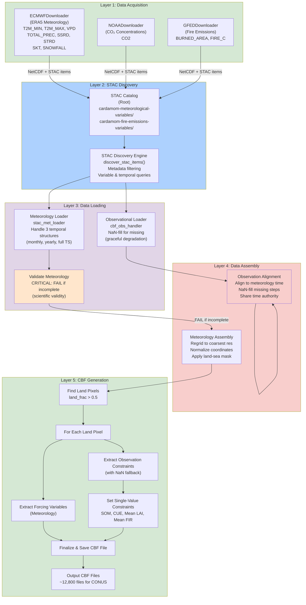

# CARDAMOM System Architecture - Mermaid Diagram

## 5-Layer Architecture Overview

## Key Principles

- **Layer 1**: Data acquisition from third-party sources
- **Layer 2**: STAC discovery with pure metadata filtering
- **Layer 3**: Data loading with validation and graceful degradation
- **Layer 4**: Assembly and alignment to common time/space grid
- **Layer 5**: Pixel-specific CBF file generation

## Time Coordinate Authority

**Meteorology** (from STAC) → **Authority** ← **Observations** (user-provided)

- Meteorology MUST be complete (FAIL if missing)
- Observations optional (NaN-fill if missing)
